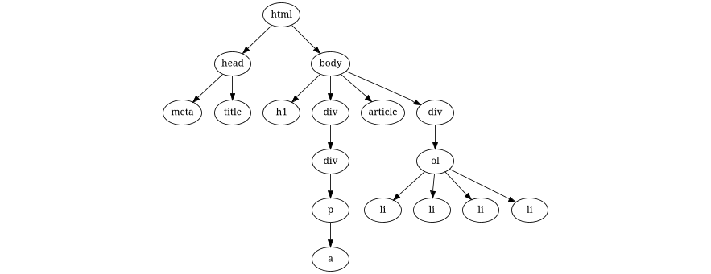

# Proje 5 (Basit HTML Agaci)

[Proje 5 Github Classroom Davet Linki](https://classroom.github.com/a/TfLcRNa5)

* Bu projede `HTMLTree` sinifinda bir HTML dokumanindaki veriler basitlestirilmis olarak saklanabilmektedir. 
* Bu proje icin HTML dokumanlarini sadece HTML etiketlerinden (taglerinden) olusan dokumanlar olarak varsayaniz.
* Sizden istenen HTMLTree sinifindaki GETHTML() metodunun islevini yerine getirebilmesi icin `HTMLTree.java` dosyasinda gerekli duzenlemeleri yapmanizdir.
* `GETHTML()` metodunun ustundeki yorum satirlarini okuyarak bu metodun nasil bir islev gerceklestirmesi gerektigini ogrenebilirsiniz.

## Uyarilar

* Projenizdeki HTMLNode.java dosyasi icinde herhangi bir degisiklik yapmayiniz.
* `HTMLTree.java` dosyasindaki constructor(yapici) kodlar uzerinde herhangi bir degisiklik yapmayiniz.
* `HTMLTree.java` dosyasindaki sinif degiskeni olan root degiskeninin tanimlandigi satirda herhangi bir oynama yapmayiniz.
* ~~Yeni bir java uzantili kaynak dosyasi olusturmayiniz.~~
* Bu proje icin gerek duyarsaniz Stack ve/veya Queue yapilarini kullanabilirsiniz. Bu amacla bu yapilari tanimlamak icin yeni java uzantili dosya(lar) olusturabilirsiniz. Bu dosyalar projede size hazir verilen java uzantili dosyalarla ayni yerde (klasorde) olmalidir. 
* Github'a yukleyeceginiz kodun derlendiginden emin olunuz. Derlenmeyen kodlar 0 puan alacaktir!

## Kodun derlenmesi

```javac HTMLNode.java HTMLTree.java Main.java```

## Kodun calistirilmasi

```java Main```

## Program ciktisi

Size verilen kod Main.java uzerinde degisiklik yapilmadiginda ve `GETHTML()` metodu dogru kodlandiginda asagidaki ciktiyi uretmelidir. Verilen ciktida agactaki her seviyenin etiketlerinin ilgili etiketin bir ustundeki seviyeden 3 karakter sagda basladigina dikkat ediniz. 

```html
Printing HTML output for document #1:
<html>
   <body>
      <div>
         <article>
         </article>
      </div>
      <p>
      </p>
      <h1>
      </h1>
   </body>
</html>
Printing HTML output for document #2:
<html>
   <head>
      <meta>
      </meta>
      <title>
      </title>
   </head>
   <body>
      <h1>
      </h1>
      <div>
         <div>
            <p>
               <a>
               </a>
            </p>
         </div>
      </div>
      <article>
      </article>
      <div>
         <ol>
            <li>
            </li>
            <li>
            </li>
            <li>
            </li>
            <li>
            </li>
         </ol>
      </div>
   </body>
</html>
Printing HTML output for document #3:
<html>
</html>
Printing HTML output for document #4:
```

###### `Main.java` altindaki GetHTML4Document1() fonksiyonunda uretilen HTML agaci


###### `Main.java` altindaki GetHTML4Document2() fonksiyonunda uretilen HTML agaci



###### `Main.java` altindaki GetHTML4Document3() fonksiyonunda uretilen HTML agaci


###### `Main.java` altindaki GetHTML4Document4() fonksiyonunda uretilen HTML agaci


## Proje Kodlari

Bu proje icin size verilen kodlari asagida gorebilirsiniz.

* `HTMLNode.java`

```java
public class HTMLNode {
    private String tag;
    private HTMLNode[] children;

    public HTMLNode(String tag){
       this(tag,  null);
    }

    public HTMLNode(String tag, HTMLNode[] children){
        this.tag = tag;
        this.children = children;
    }

    public void setChildren(HTMLNode[] children) {
        this.children = children;
    }

    public HTMLNode[] getChildren(){
        return children;
    }

    public String getTag(){
        return this.tag;
    }
}
```

* `HTMLTree.java`

```java
public class HTMLTree {
    private HTMLNode root;

    public HTMLTree(HTMLNode root){
        this.root = root;
    }

    public HTMLTree(){
        this(null);
    }

    
    // Bu metod bu sinifta saklanan HTML agacinin icerigini String olarak dondurmektedir.
    // Bu metodu yazmak icin bu sinif icinde baska yardimci baska metod/metodlar tanimlayabilirsiniz.
    // Bu metodu recursive olarak yazmaniz beklenmektedir.
    // Bu metodu daha kolay kodlayabilmeniz icin string birlestirme operatoru olan `+` operatorunun
    // nasil kullanildigina ve String sinifi metodlarindan biri olan repeat metodunu arastirmaniz
    // tavsiye edilmektedir.
    // Bu metodun dogru kodlanmasi durumunda uretmesi beklenen cikti Main.java sinifi icindeki kodlar 
    // ve bu kodlarin uretecegi program ciktisi incelenerek gorulebilir. 
    public String GetHTML(){
        // Metodun icini uygun sekilde doldurunuz.
    }

}
```

* `Main.java`

```java
public class Main {
    public static void main(String args[]) throws Exception{
        System.out.println("Printing HTML output for document #1:");
        System.out.print(GetHTML4Document1());

        System.out.println("Printing HTML output for document #2:");
        System.out.print(GetHTML4Document2());

        System.out.println("Printing HTML output for document #3:");
        System.out.print(GetHTML4Document3());

        System.out.println("Printing HTML output for document #4:");
        System.out.print(GetHTML4Document4());
    }

    public static String GetHTML4Document1(){
        HTMLNode body = new HTMLNode("body");
        HTMLNode html = new HTMLNode("html");

        HTMLNode p = new HTMLNode("p");
        HTMLNode h1 = new HTMLNode("h1");
        HTMLNode div = new HTMLNode("div");

        HTMLNode article = new HTMLNode("article");

        HTMLNode[] divChildren = new HTMLNode[]{article};
        HTMLNode[] bodyChildren = new HTMLNode[]{div, p, h1};
        HTMLNode[] htmlChildren = new HTMLNode[]{body};

        html.setChildren(htmlChildren);
        body.setChildren(bodyChildren);
        div.setChildren(divChildren);

        HTMLTree tr = new HTMLTree(html);
        return tr.GetHTML();
    }

    public static String GetHTML4Document2(){
        HTMLNode article = new HTMLNode("article");
        HTMLNode a = new HTMLNode("a");
        HTMLNode p = new HTMLNode("p");
        HTMLNode h1 = new HTMLNode("h1");

        HTMLNode div1 = new HTMLNode("div");
        HTMLNode div2 = new HTMLNode("div");
        HTMLNode div3 = new HTMLNode("div");

        HTMLNode ol   = new HTMLNode("ol");
        HTMLNode li1   = new HTMLNode("li");
        HTMLNode li2   = new HTMLNode("li");
        HTMLNode li3   = new HTMLNode("li");
        HTMLNode li4   = new HTMLNode("li");

        HTMLNode body = new HTMLNode("body");
        HTMLNode head = new HTMLNode("head");
        HTMLNode title = new HTMLNode("title");
        HTMLNode meta = new HTMLNode("meta");
        HTMLNode html = new HTMLNode("html");

        HTMLNode[] htmlChildren = new HTMLNode[]{head, body};
        HTMLNode[] bodyChildren = new HTMLNode[]{h1, div1, article, div2};
        HTMLNode[] headChildren = new HTMLNode[]{meta, title};

        HTMLNode[] div1Children = new HTMLNode[]{div3};
        HTMLNode[] div3Children = new HTMLNode[]{p};
        HTMLNode[] pChildren = new HTMLNode[]{a};

        HTMLNode[] div2Children = new HTMLNode[]{ol};
        HTMLNode[] olChildren = new HTMLNode[]{li1, li2, li3, li4};

        html.setChildren(htmlChildren);
        body.setChildren(bodyChildren);
        head.setChildren(headChildren);

        div1.setChildren(div1Children);
        div3.setChildren(div3Children);
        p.setChildren(pChildren);

        div2.setChildren(div2Children);
        ol.setChildren(olChildren);

        HTMLTree tr = new HTMLTree(html);
        return tr.GetHTML();
    }

    public static String GetHTML4Document3(){
        HTMLNode html = new HTMLNode("html");
        HTMLTree tr = new HTMLTree(html);
        return tr.GetHTML();
    }

    public static String GetHTML4Document4(){
        HTMLTree tr = new HTMLTree(null);
        return tr.GetHTML();
    }
}
```
